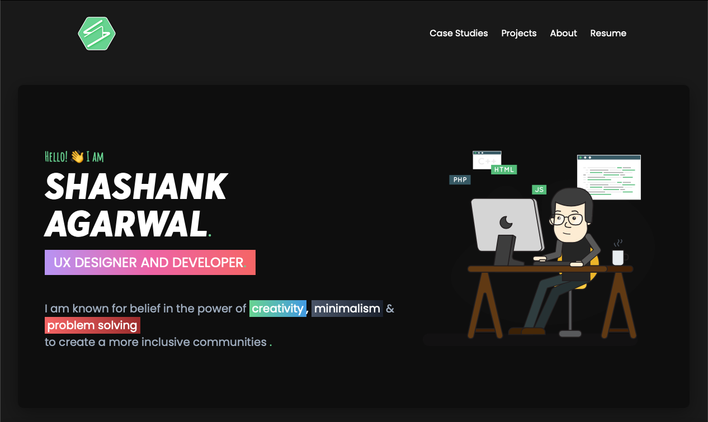

# My Portfolio Website Documentation

- When i start my web development journey i really love creating static websites using HTML, CSS and JS
- At that time, i create my first portfolio website for my static websites portfolio [My First Portfolio Website](https://shashankagarwal.netlify.app)
- But it was static to include any project and I have to create more HTML pages and edit everytime include any new project in the core codebase
- So, I decided to create my Portfolio Website Dynamic So I just include my projects using Content Mangement System.
- After Learning about ReactJS and Headerless CMS More, I start working on my Project

## How it Started

- I start Learn More about Headerless CMS to integrate my front-end with Headless CMS
- What **Headerless Content Management System** really do ?
- It basically acts as an content repository which can be accessible _via_ an API for display on any device.

### My Technology Stack

1. React
2. Sanity
3. Tailwind
